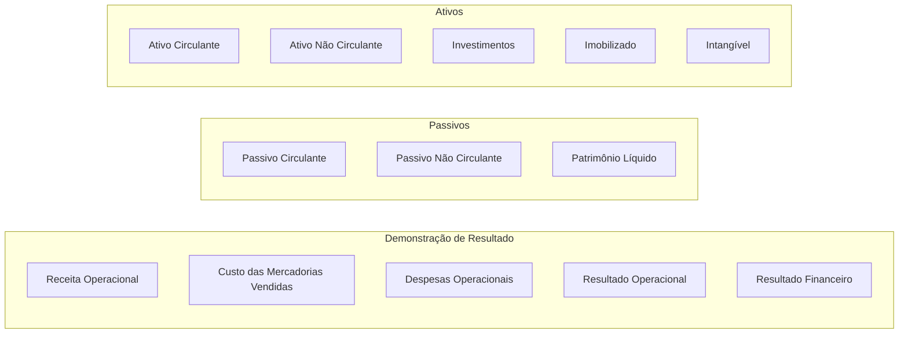
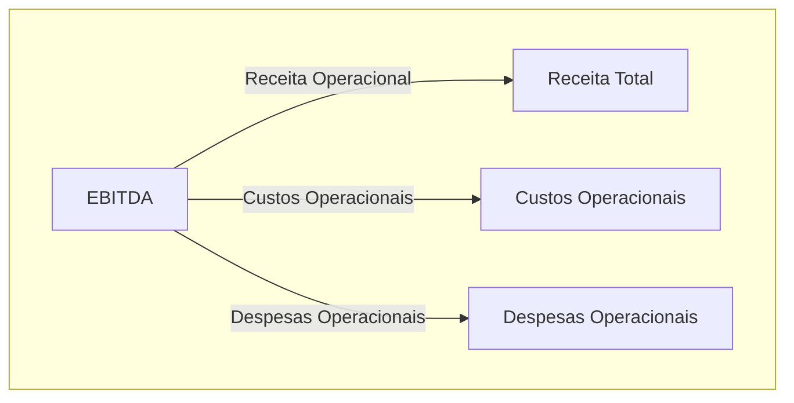
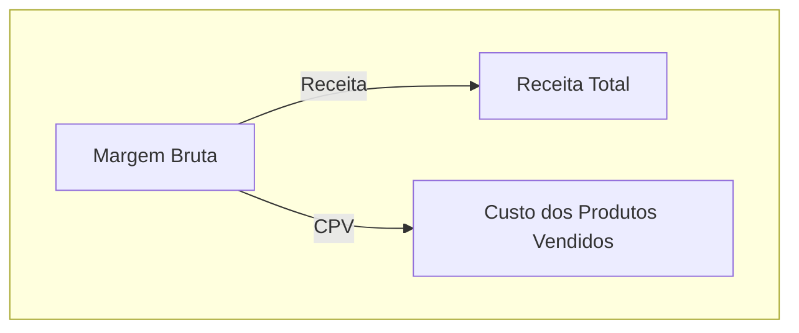
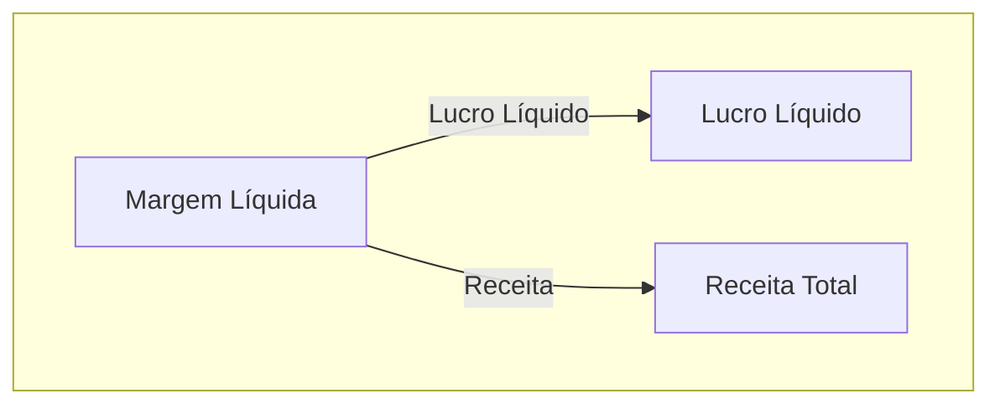
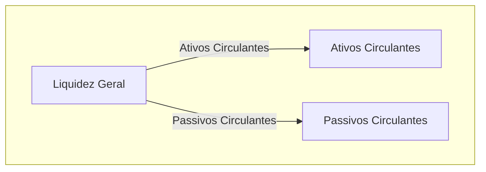
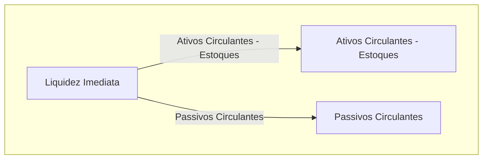

# Documentação BI Contábil

Para acessar esta aplicação, visite <a href="https://app.powerbi.com/view?r=eyJrIjoiMTgwNWIxOWQtMTkyYS00ODlhLWIwOTktYWFjNzQ0YTE5MzY1IiwidCI6IjVhY2IyMzk2LWE2ZWEtNDY2Yy1iYmZlLWQ5YTM5MzZmZjUzOCJ9" target="_blank"> analytics.contabil</a>.

## Estrutura do Balanço Patrimonial

## Indicadores Financeiros

Nesta seção, vamos explorar alguns indicadores financeiros essenciais para avaliar a performance e a saúde financeira de uma empresa.

### EBITDA (Lucro Antes de Juros, Impostos, Depreciação e Amortização)

O **EBITDA** é um indicador financeiro amplamente utilizado para avaliar a lucratividade operacional de uma empresa, desconsiderando fatores não operacionais. Ele é calculado pela fórmula:

O EBITDA é útil para comparar a performance operacional entre empresas de diferentes setores e para analisar tendências ao longo do tempo.

### Margem Bruta

A **Margem Bruta** é calculada como a porcentagem de lucro bruto em relação à receita total. Ela é obtida pela fórmula:

Onde:
- **CPV** = Custo dos Produtos Vendidos

A Margem Bruta indica a eficiência da empresa na geração de lucro a partir da venda de seus produtos ou serviços.

### Margem Líquida

A **Margem Líquida** representa a porcentagem de lucro líquido em relação à receita total. É calculada pela fórmula:

A Margem Líquida é um indicador-chave da rentabilidade da empresa, levando em conta todos os custos e despesas, incluindo impostos e juros.

### Liquidez Geral

A **Liquidez Geral** é uma medida da capacidade de uma empresa de cumprir suas obrigações de curto e longo prazo. É calculada pela fórmula:

Um índice superior a 1 indica que a empresa possui mais ativos líquidos do que passivos a curto prazo, o que é positivo em termos de solvência financeira.

### Liquidez Imediata (ou Liquidez Seca)

A **Liquidez Imediata**, também conhecida como **Liquidez Seca**, é uma medida mais restrita da capacidade de pagamento imediato de uma empresa. É calculada pela fórmula:

Esse indicador exclui os estoques da equação para fornecer uma visão mais conservadora da capacidade da empresa de pagar suas dívidas de curto prazo apenas com ativos líquidos imediatos.

